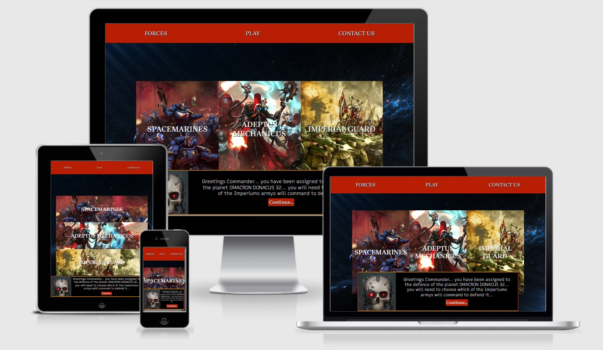

# Javascriptus-Crusade (Milestone Project 2)

[Visit My Site Here](https://ibrazyi.github.io/Javascriptus-Crusade/)

## Overview
This website is both a old style text based game and a good starting point for those interested in learning about the Warhammer 40k universe. 
Containing both information and a look into the Universe; who are the factions that populate it and the interactions between them.
With a minimalistic user interface and a space theme with both background and dark colours it emanates the grim-dark theme of the setting.

## Table of Contents

[UX](#ux)

[Features](#features)

[Technologies Used](#technologies)

[Testing](#testing)

[Deployment](#deployment)

[Credits](#credits)

## UX
### User Stories
#### A First Time Visitor
- I want to be able to navigate the site easily and understand what it is for.
- I want to be able to find information easily and not be confused by the websites content or structure.
- I want to understand more about the Warhammer 40k Universe, understand the factions and the interactions between them.
- I want to enjoy the game, understand how it works and beat it.

#### A Returning User
- I want to quickly access information that I have forgotten.
- I want to complete the game again with different factions to play as or play against.
- I want to suggest an new idea or faction for the game and submit it to the creator.
- I want to sign up to the mailing list to see when new features and game modes are released.

#### A User already with Warhammer 40k knowledge
- I want the site information to be true to the knowledge I already have.
- I want to see the factions I already know play against each other and be excited by the interactions between them.

#### A User looking to spend time playing a game
- I want to play a game that is fun and I enjoy spending time on.
- I want the game play area to look good, be intuitive to use and navigate.
- I want to be challenged by the game and complete all the modes, exploring more difficult content.

### Strategy
- The aim of the website is to provide the user with an interesting game experience that is fun to play while easy to pick up and understand.
- The sites goal is also to provide users both with and without Warhammer 40k knowledge a basic foundation of information for all the factions involved in the game and how they interact with each other.

### Scope
- Provide the user with a basic but enjoyable text based game with replayability and role play.
- Provide visitors with a clean and easy to navigate user interface.
- Provide concise but factual information about the theme and the game itself.
- Allow users to influence the content of the game and get in contact with the creator.

### Structure
#### Interaction Design
- Create a website/game that is responsive, works at all screen sizes and has mobile table and PC compatibility.
- Allow for easy navigation between pages of the website.
- Provide a easy to understand ascetically pleasing game interface that makes it obvious what the user needs to do to progress.
#### Information Architecture
- Content is well structured, in line with the theme, easy to read and distinguish between.
- Images are used mostly as navigation tool, each one representing a different faction in the game, allowing for the user to physically see who they are choosing without having to guess.

### Skeleton
#### Mobile Wireframes

   
   

#### Desktop/Tablet Wireframes

   
   

#### Information Design
- Information for each faction is dynamically obtained depending on which faction is selected.
- Information layout is structured in a linear format, sub heading and information text.
- Navigation and background information are represented using a smaller text box pinned to the bottom of the screen,
- The game information is displayed in its own text box providing background and with an image below representing the situation.

#### Interface Design
- Images are used as selectors for both the main page and information pages of the site. Reducing page clutter and allowing easy interaction.
- The game interface is basic with clear well structured options. With question and answers split with an image between them.

#### Navigation Design
- Navigation is located at the top of the page, with three options.
- The navigation links are text even at smaller screen sizes so the user will know what option to select if they need more information.

### Surface
#### Typography
Three different fonts have been selected for use on this site/game. All fonts have been obtained from [Google Fonts](https://fonts.google.com/).
- Pathway Gothic: Used for all headings and titles, bold and stand out font.
- Brygada 1918: Used for all paragraph text and used in game section for question and answers. Easy to read and has a slight military appearance.
- Recursive: Used for "talking head" text box, keeps to the grim dark theme of the site/game and has a military/typewriter style.

#### Colour Scheme

## Features
The site is split up into three different HTML pages, responsive at all screen sizes and follow a similar style and aesthetic.
- Index/Play: This is the initial landing page for the user, upon loading an intro animation plays setting the scene and helping to show the theme of the rest of the page.
    Upon completion of the intro the player is landed at the main area of the page, where they can select each item on the nave bar but also select the faction they wish to
    play in the game. They are then taken to the next area where they select the enemy they wish to face and one that is done they are taken to the game screen. At certain points
    within the site a text box giving the player information and direction displays at the bottom of the screen. When the player reaches the play screen they are faced with a question
    and three answers to pick from, these answers contain hidden values and the player must select what they think is best in the given situation. As they progress the situation will
    become more and more dire and their choices will have larger effects. Upon victory or defeat the player is then taken to the relevant page where they can chose to continue back to
    the faction selection area and play again.
- Forces: Upon selecting the Forces 'nav' element the user will be taken to the page. Here they will be able to chose which faction they wish to find information on which is then obtained
    dynamically using java script. This information is then displayed separately.
- Contact us: Upon selecting this page the user is then taken an area where they can both sign up to a mailing list and submit their name and their own suggestions to the creator. These forms
    are validated with the use of java script.
#### Existing Features 
- Basic text based game, with multiple options and a hidden health system giving the user the sense of choice.
- Dynamic display of information using java script and pre defined variables rather than using HTML text.
- Created the Index/Play page with HTML elements and changed the content using java script.
- Created Forces page using only java script to create all elements, interactions and content.

#### Features Left to Implement
 - Add more factions and enemies to the game screen, increasing replayability.
 - Add more options for each level of the game that have more interactions such as a 50/50 chance to change the outcome for better or worse. 
 - Add links and more information to the lore and hobby of Warhammer 40k and letting the user know more about the hobby.

## Technologies Used

### Languages
- HTML5: Used as the basic structure for Index/Play page, also used to create header element for all pages.
- CSS3: Used to style and structure all content.
- Java script: Used to provide all functionality for all aspects of the site including; game play and interactions, dynamically changing information
     displayed on pages and also for the intro sequence.
### Programs
- VS Code: Where all coding took place.
- Adobe XD: Used to create wireframes.
- Git Hub: Used to host the websites repository.
- Git Hub Desktop: Used to access the repository linking it to online Git Hub profile.
- IAmResponsive: Used to test responsiveness of site.
- Coolors: Used to display colour pallet used.
- [HTML Validator](https://validator.w3.org/) - Used to check HTML code for errors.
- [CSS Validator](https://jigsaw.w3.org/css-validator/) - Used to check CSS code for errors.

## Testing

### Nav Bar
- Checked that all links work correctly, taking the user to the desired page.
- Nav bar loads after the intro sequence, and upon refreshing into sequence does not run.

### Forces
- Check that upon clicking each faction separately the information is correct.
- Layout remains correct even when displaying assets with more or less text.

### Contact Us
- Both links work and submit correctly.
- Email validation works, only email addresses are allowed to be submitted.

### Play
#### Faction Selection
- Faction selection works as intended.
- Hovering over faction give a short summary of the faction.
- Local storage stores the faction selected.
- "Talking head" displays correct text cycles through the two sets of text and then remains hidden until page reload.

#### Enemy Selection
- Enemy selection works as intended.
- Hovering over enemy gives a short summary
- Local storage saves the enemy selected.
- "talking head" displays correct text and remains hidden upon clicking.

#### Game Screen
- Game loads correct, correct questions and answers are loaded dependant on which faction and enemy were selected.
- Game image loads correctly and different for which campaign was selected.
- Testing each option displays the correct damage and health, then loads the next set of question and answers.
- Tested using console.logs to display information within the code. 

#### Victory/Defeat
- Victory page shows if player health is about 0 after the 5th and last question of the game.
- Defeat page shows when player health reaches 0. Displays correctly.
- Local storage is cleared after each round of the game to reset the faction and enemy.

### Code Validators
- HTML Validator shows no errors.

- CSS Validator shows no errors.

### Devices
- Galaxy S9: Works as intended.
- Galaxy S20: Works as intended.
- I phone 6: Works as intended.
- I phone 11: Works as intended.
- I Pad:  Works as intended.
- Small screen laptop: Works as intended.
- Large screen laptop: Works as intended.
- Desktop:  Works as intended.

### Browsers 
- Firefox: Working as intended no errors.
- Microsoft Edge: Working as intended no errors.
- Chrome: Working as intended no errors.

## Deployment

### Creating Repository
1. Created new file inside documents folder named "Coding Course" and within that created a file called "Javascriptus-Crusade(Milestone Project 2)"
2. Opened GitHub Desktop and selected "New Repository"
3. Gave the project name "Sharks-Under-Threat" and clicked "Create Repository"
4. Opened the repository in VS Code
5. Created index.html and README.md pages
6. Opened up local terminal and "Git Added" both pages.
7. Committed both pages using "Git Commit".
8. Pushed changed with "Git Push" adding my work to my Git Hub page.
9. Opened my GitHib page to see the changes.

### Viewing Site
1. After logging in to GitHub I went to the "settings" tab.
2. Upon scrolling down to "Danger Zone" I set the repository to "Public".
3. Scrolling back up to "GitHub Pages" set the source "Branch-main", "File-Root" and selected save.
4. After reloading and scrolling back down to "GitHub Pages" selected the link where my site had been published.

## Credits

### Technical
- Google Fonts: Used for all fonts on the website.

 ### Content 
 Information and content about the Warhammer 40k factions and inspiration for the campaigns.
 
 
 
 ### Images
  
  
  
  
  
  
  
  
  
  
  
  
  
  
  
  
  
  
  

 ### Acknowledgements
- Code Institute - Running the course and providing this opportunity. 
- Maranatha Ilesanmi (Mentor) - Feedback and support during the project. 
- Slack Community - Peer reviewing my work. 
